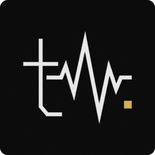

# tide

a brutalist youtube music client. native Qt6, MPRIS2, Discord Rich Presence,
10 swappable themes, no electron.



## install (Arch / AUR)

```sh
yay -S tide        # release
# or
yay -S tide-git    # latest from git
```

then launch `tide` (or click the menu entry). that's the whole setup —
click "import", and you're in.

## first run

tide signs you into YouTube Music by importing the cookies from your real
browser. it does **not** make you paste anything into a config file. on
first launch:

1. open `music.youtube.com` in your usual browser, make sure you're signed in.
2. tide opens its sign-in dialog — click `import`.
3. dialog closes, main window appears.

supported browsers: chromium, chrome, brave, vivaldi, microsoft edge.
on KDE, kwallet must be unlocked. on GNOME, libsecret / gnome-keyring.

## features

- **search** any song from YouTube Music's catalog.
- **library**: your playlists + liked songs.
- **queue + radio**: autoplay continues forever after a song finishes.
- **lyrics**: when YT has them (untimed).
- **MPRIS2**: media keys + KDE Plasma / GNOME / waybar / playerctl all work.
- **Discord rich presence**: opt-in (settings → discord). bring your own app id.
- **10 themes**: switch live in settings → appearance, or drop your own in
  `~/.config/tide/themes/<name>/`.
- **volume meter + slider** with scroll-wheel + Ctrl+↑↓ shortcuts.

## bundled themes

| theme | feel |
|---|---|
| `brutalist-mono` | terminal black + amber, mono, `[play]` controls |
| `gruvbox` | warm retro dark, mustard accent, mono |
| `terminal-green` | CRT phosphor on jet black |
| `solarized-light` | ergonomic parchment + blue |
| `paper` | calm warm cream + crimson |
| `nord` | polar dark + frost teal |
| `catppuccin` | mocha pastels, soft pink |
| `rose-pine` | romantic dusk mauve/rose |
| `ambient` | charcoal + lavender, heavy rounded |
| `synthwave` | neon magenta/cyan on deep purple |

## shortcuts

| key | action |
|---|---|
| Ctrl+1 / 2 / 3 / 4 | search / library / queue / lyrics |
| Ctrl+, | settings |
| Ctrl+F or Ctrl+L | focus search |
| Space | play / pause |
| Ctrl+→ / ← | next / previous track |
| Ctrl+↑ / ↓ | volume +/− 5 |

right-click any track for play-now / play-next / add-to-queue / start-radio.

## file locations

- `~/.config/tide/settings.toml` — theme, discord, volume (don't edit by hand)
- `~/.config/tide/browser.json` — imported YT cookies (don't edit by hand)
- `~/.config/tide/themes/` — your custom themes
- `~/.cache/tide/` — stream URL cache, art cache
- `~/.local/share/tide/` — webview profile leftover (safe to delete)

## license

GPL-3.0-or-later.

## non-affiliation

not affiliated with YouTube / Google. uses public YT Music APIs via the
ytmusicapi library and yt-dlp for stream resolution.
