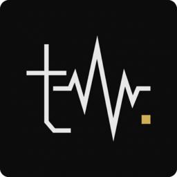
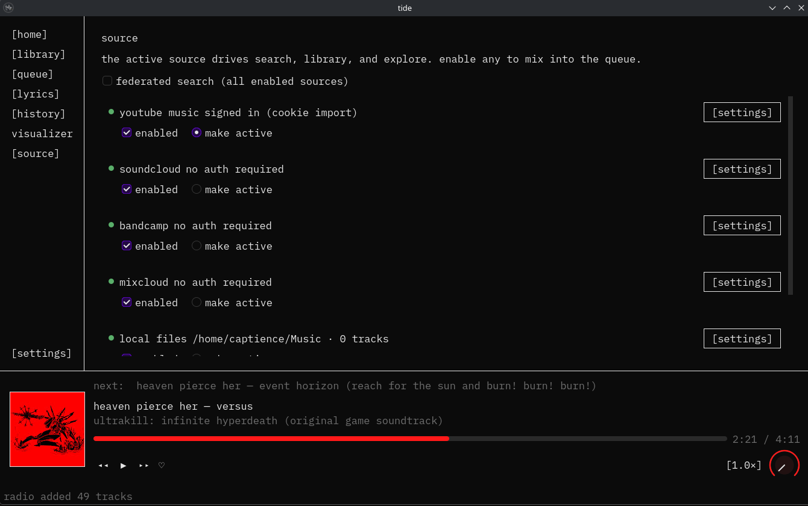
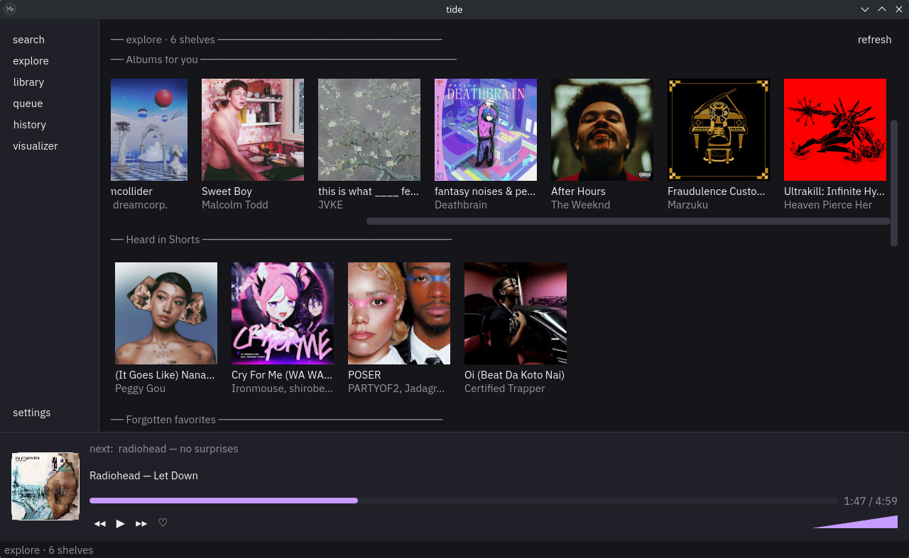
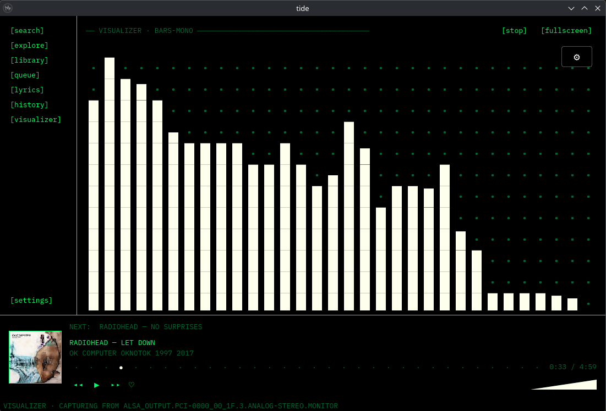
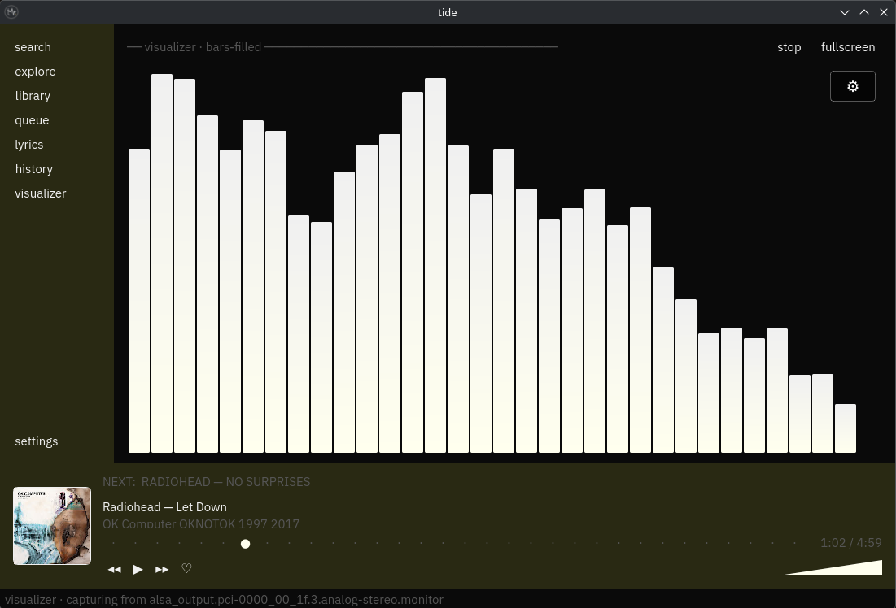
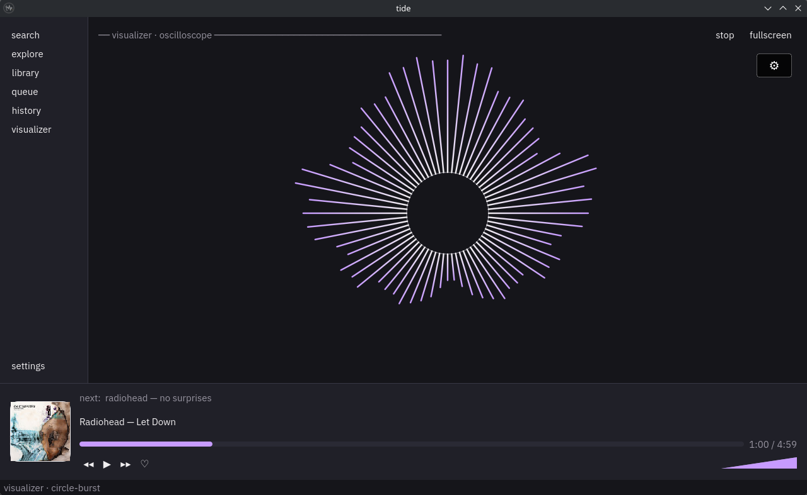
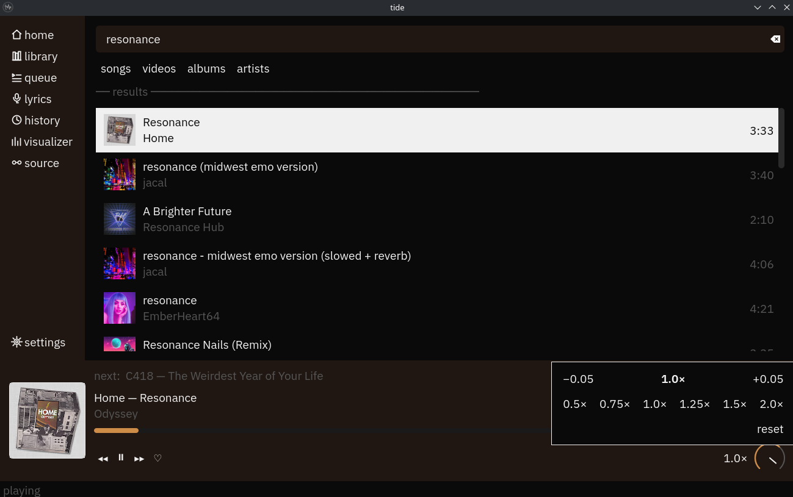
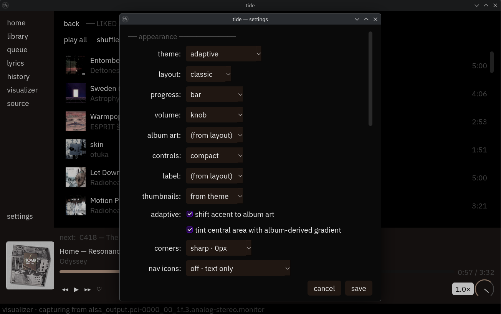
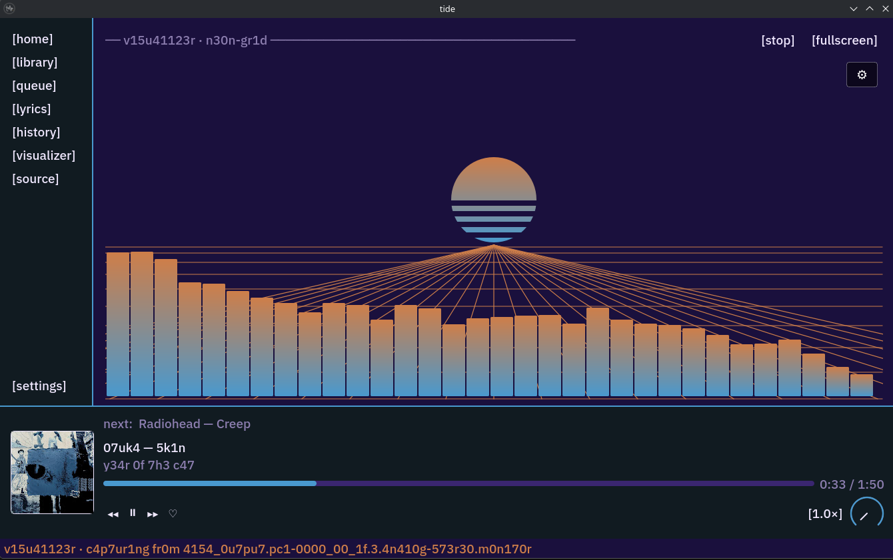

<div align="center">



# tide

**a brutalist multi-source music client**

native Qt6 · 7 sources · 11 themes · 10 visualizers · 4 layouts · MPRIS2 · audio fx rack · adaptive accent + backdrop · pitch-shifting speed · zero config-file editing

[](https://github.com/captiencelovesarch/tide/releases/latest)
[](https://aur.archlinux.org/packages/tide)
[](LICENSE)
[](https://archlinux.org)
[](https://www.qt.io)

</div>

---

<div align="center">


<sub>adaptive theme · album-tinted living backdrop · synced lyrics</sub>

</div>

```sh
yay -S tide
```

then launch `tide`, click **`[import]`**, you're listening. that's the whole setup.

## what it is

tide is a **standalone desktop client for music — from anywhere you can stream it**. native Qt6 — not an Electron skin. it sits on top of `mpv`, talks to YouTube Music via `ytmusicapi`, resolves streams via `yt-dlp`, speaks the Subsonic API to your self-hosted server, reads your local files via `mutagen`, and renders everything in IBM Plex with monochrome + an accent color you can let the album cover dictate.

it was designed for one thing: to be **the music app that has a sense of itself**. no shipped defaults are middle-of-the-road. brutalist-mono ships as the default; if you don't like brutalism, swap themes from a dropdown — same app, completely different personality.

## sources

press `Ctrl+8` for the `[source]` panel — every source is one toggle away.

| | tag | search | library | requires |
|---|---|---|---|---|
| **youtube music** | `[YT]` | ✓ | ✓ (playlists + albums + artists + home shelves) | cookie import |
| **spotify** | `[SP]` | ✓ | ✓ (playlists + liked songs) | spotify login (OAuth) — **playback shelved, see note** |
| **subsonic / navidrome** | `[SS]` | ✓ | ✓ (playlists + albums + artists + home shelves) | your server's url + login |
| **local files** | `[LO]` | ✓ | ✓ (albums + artists) | a music directory |
| **soundcloud** | `[SC]` | ✓ | — | nothing |
| **bandcamp** | `[BC]` | ✓ | — | nothing |
| **mixcloud** | `[MC]` | ✓ | — | nothing |

queue is source-agnostic. mix a YT Music search, a Bandcamp deep cut, and a local FLAC in the same queue — tide dispatches each to the right backend. **federated search** mode (toggle in the source panel) runs every enabled source in parallel and tags each result row so you can see where the hit came from.

> **note on spotify** · the integration is shipped but shelved — spotify's 2026-02-06 platform-security update started refusing audio-decryption keys to librespot regardless of how it authenticates, so audio plays as silence on every account we've tested. search, your library, and liked songs all work, and tide still appears as a Connect device — but enabling spotify pops a confirmation explaining that playback is broken. when (if) spotify reopens or librespot upstream patches it, playback starts working with no code change.

<div align="center">



<sub>`Ctrl+8` — each source one toggle away</sub>

</div>

## features

### playback

- search the YouTube Music catalog (your account or anonymous)
- your **library + playlists** (liked songs first)
- **queue + radio autoplay** — when the queue runs low, tide pulls a continuous radio seeded from the last track
- **lyrics** — YT Music's own line-synced lyrics first (matched to the exact video you're playing), LRClib as fallback, plain text as a last resort. synced view auto-scrolls with the active line bold; **karaoke mode** highlights per word
- **drag-to-reorder queue**, sleep timer (Ctrl+I), like button (Ctrl+H), history view, mini-mode (Ctrl+M)
- **resume on launch** — quit mid-song, relaunch, picks up paused at the same position
- **stream-URL prefetch** — once a track has ≤15s remaining, tide pre-resolves the next one. auto-advance is ~instant on cache hit; silent fallback to normal resolve on miss
- **expired sessions announce themselves** — when YT Music cookies die, tide tells you with a sticky toast + `[sign in]` button that re-runs the import in place. no more mystery empty library

<div align="center">


<sub>synced lyrics — YT Music's own timings first, LRClib fallback · active line bolds + auto-scrolls</sub>

</div>

### discovery (Ctrl+1)

- YT Music's home shelves rendered as horizontal card rows — personalized when signed in (quick picks, listen again, mixed for you)
- subsonic home shelves too (newest / frequent / starred / random)
- artist detail (top songs + albums + singles + related)
- album detail (cover + tracklist + play all / shuffle)
- search filter tabs: `[songs] [videos] [albums] [artists]`

<div align="center">



</div>

### look & feel

- **11 themes**, each with its own personality:

  | | font | case | accent |
  |---|---|---|---|
  | **brutalist-mono** (default) | IBM Plex Mono | lowercase | amber `#d4b95e` |
  | gruvbox | IBM Plex Mono | lowercase | mustard |
  | terminal-green | IBM Plex Mono | UPPERCASE | CRT green |
  | solarized-light *(light)* | IBM Plex Mono | normal | blue |
  | paper *(light)* | IBM Plex Sans | normal | crimson |
  | nord | IBM Plex Sans | normal | frost |
  | catppuccin mocha | IBM Plex Sans | normal | pink |
  | rosé pine | IBM Plex Sans | normal | rose |
  | ambient | IBM Plex Sans | normal | lavender |
  | synthwave | IBM Plex Sans | **`L33T`** | neon magenta + cyan |
  | adaptive | IBM Plex Sans | normal | follows current album art |

  drop your own in `~/.config/tide/themes/` — the case engine also speaks `zalgo`, if you hate yourself.

<div align="center">

<table>
<tr>
<td></td>
<td></td>
<td></td>
</tr>
</table>

<sub>same app, three themes</sub>

</div>

- **4 layout presets**: `classic`, `focused` (big art, soft controls), `dj-deck` (queue front-and-center), `walkman` (portrait phone-shape) — each swaps widget variants (progress style, volume style, album-art shape, controls size, label arrangement). your own go in `~/.config/tide/layouts/`
- **adaptive accent** — opt-in toggle that animates the theme accent toward the current cover's dominant color, weighted by real pixel mass so green covers stay green
- **living adaptive backdrop** — the whole central area breathes with album-derived color: three styles (`living fields` / `diagonal band` / `bass arch`), drifting slowly and optionally **swelling on bass** via the same capture feed the visualizer uses
- **per-theme text case** — synthwave renders `H3110 W0R1D`, terminal-green renders `ALL CAPS`, brutalist stays lowercase
- **3 bundled font families** — IBM Plex Mono, JetBrains Mono, Inter — plus a font picker that overrides any theme's typography (accepts arbitrary system family names)
- **themed nav icons** — bundled brutalist SVG line-art (recolored to the active theme's `fg`), classic mono glyphs, emoji, or none

### motion & feel

- **motion intensity** — `off` / `lite` (default — signature + everyday animations) / `full` (everything including atmospheric). respects the reduced-motion env hint and clamps `full` to `lite` when set.
- **track-change signature** — title decodes left-to-right from random block glyphs while the album art crossfades; layered on top of the adaptive accent fade for a triple-timeline reveal.
- **playback speed** — popover with `−0.05` / `+0.05` nudges, preset buttons (`0.5× 0.75× 1.0× 1.25× 1.5× 2.0×`), and a reset (right-click the button also resets). pitch-shifted by default for the slowed-and-reverb / nightcore vibe; toggle "preserve pitch" in settings for audiobook use. shortcuts: `[` slow · `]` fast · `\` reset.
- **audio fx rack** — `Ctrl+9` for the full panel: 10-band graphic EQ (32 Hz → 16 kHz, ±12 dB) with preset cards (`flat / bass boost / treble boost / vocal boost / v-shape / soft warmth`) and 3 user-saved slots, reverb preset bank (`off / room / hall / cathedral / `**`slowed`**) with wet slider, bass + treble shelves, loudness normalization (EBU R128, −14 LUFS), stereo width, compressor, mono fold. quick `[fx]` popover next to `[speed]` for one-click preset + reverb + shelves. right-click `[fx]` toggles the whole rack on/off. pair the **slowed** reverb with speed 0.85× + pitch-correction off for the canonical tide signature. works on every mpv-played source.
- **UI sounds + crossfading views** — short percussive sounds on nav clicks, soft pops on modal open/close, chirps on toggle flips. auto-muted the second music starts playing so they never compete with the player. six bundled WAVs (hand-authored), defaults **off** — opt in via Settings → appearance → "ui sounds".
- **UI scale** — `compact (0.85×) / normal / large (1.15×) / huge (1.30×)`. cascades through every fixed-size widget (track row, album art, cards, album/artist pages, view margins).
- **soft corners** — `sharp` / `soft (6px)` / `rounded (12px)` applies a sticky `@radius` override on inputs, scrollbars, album art, and the central-area clip.
- **customizable loading bar** — five styles in the status bar tracking the resolve → buffer → playing window: `off`, `numbers`, `blocks`, `dots`, `ascii`.

<div align="center">

<table>
<tr>
<td></td>
<td></td>
</tr>
</table>

<sub>speed popover (left) · appearance settings — motion / ui scale / corners / nav icons / ui sounds / backdrop (right)</sub>

</div>

<!-- uncomment when assets/screenshots/fx-rack.png lands
<div align="center">


<sub>`Ctrl+9` — 10-band EQ · reverb bank · shelves · loudness norm · the slowed signature</sub>

</div>
-->


### audio visualizer (Ctrl+7, F11 for fullscreen)

10 theme-aware renderers driven by a PipeWire monitor capture (`parec`) + numpy FFT pipeline:

- `bars-mono` `▁▂▃▅▆▇█` — for mono themes
- `bars-filled` — gradient rectangles, sans themes
- `oscilloscope` — waveform line + halo (ambient)
- `waveform-envelope` — fast filled envelope, cheap on large/HiDPI windows
- `neon-grid` — synthwave perspective grid + spectrum bars
- `circle-burst` — radial 360° spectrum
- `mirror-bars` — symmetric VU-style EQ
- `dot-matrix` — pixelated reactive grid (brutalist)
- `starfield` — particles flying toward camera, bass-driven speed
- `matrix-rain` — cascading characters

in-canvas `⚙` cog overrides renderer + audio source on the fly; the capture is reference-counted and shared with the ambient backdrop's bass pulse, and it respawns itself if the audio server hiccups.

<div align="center">



<sub>synthwave theme + `neon-grid` renderer</sub>

</div>

### system integration

- **MPRIS2** over QtDBus — media keys, KDE Plasma & GNOME panel controls, lockscreen art, live playback-rate reporting
- **Discord rich presence** — opt-in, shows `0:34 / 3:42` progress with current track + album cover (you bring your own Discord app ID). the progress bar stays honest at 0.5×–2× playback speed, and an opt-in **live lyric mode** swaps the state line for the synced lyric under the playhead (`♪ like this`) — off by default, since it broadcasts lyrics to anyone who can see your profile
- **ListenBrainz scrobbling** — opt-in, paste your user token — *now playing* on start, listen submitted at 30s / 50% / 4min
- **system tray** (KDE/GNOME) — hide-to-tray on close, full controls in the tray menu
- **daily update check** — toast when a newer release lands on GitHub (link-allowlisted to github.com, like every URL tide opens)

### security posture (v1.2.4)

the 1.2.4 release was a full hardening pass — short version:

- config/cache/data roots are `0700`, every credential file is `0600`, written atomically (settings keep a self-healing `.bak`)
- subsonic credentials never persist inside cached stream URLs, and plain-password auth silently refuses to cross plain HTTP
- album-art fetches are http(s)-only, size-capped, and timeout-bounded — a hostile server can't hand tide `file://` paths or a 4 GB body
- mpv gets a scheme allowlist, so no source can smuggle `edl://`/`lavfi://` meta-protocols into playback
- every remote string renders as plain text — no HTML injection via track titles, lyrics, or server error messages

details in [SECURITY.md](SECURITY.md) and the [changelog](CHANGELOG.md).

## install

### arch linux

tide is on the [AUR](https://aur.archlinux.org/packages/tide):

```sh
yay -S tide
```

that's it — your AUR helper pulls every dependency, including `python-spotipy` (the only one that isn't in the official repos). `paru -S tide` works the same way.

<details>
<summary>building from source instead</summary>

```sh
yay -S python-spotipy      # AUR — the only dep not in the official repos
git clone https://github.com/captiencelovesarch/tide.git
cd tide
makepkg -si
```

note that the PKGBUILD builds from the **tagged release tarball**, not your checkout — so this gets you the same package as the AUR, just built by hand. to build the working tree instead, use `PKGBUILD-git`.

</details>

tide ends up at `/usr/bin/tide`. desktop launcher + icon get installed for KDE/GNOME menus.

### sign in

on first launch, tide opens a small dialog: open YT Music in your browser, sign in normally, click **`[import]`** in tide. tide reads the cookies straight out of your chromium-family browser (decrypting via your kwallet/libsecret key) — or use the embedded sign-in window if you'd rather not touch your browser profile. you're in.

supported browsers: Chromium, Chrome, Brave, Vivaldi, Microsoft Edge. **OAuth doesn't work** for YT Music as of 2024 — Google blocks WEB_REMIX endpoints for OAuth-bearer tokens — so cookies are the only working path.

once signed in, tide is self-sufficient: playback authenticates yt-dlp from the same imported cookies (no browser needs to be running), which also unlocks higher-bitrate formats. if the cookies expire, tide says so and offers `[sign in]` in place.

### other linux distros

not officially supported, but doable:

```sh
sudo apt install python3 mpv libmpv-dev fonts-ibm-plex pipewire-pulse   # debian/ubuntu equivalent
pip install --user pyside6 ytmusicapi yt-dlp python-mpv cryptography mutagen spotipy numpy
pip install --user pypresence secretstorage watchdog                    # optional extras
git clone https://github.com/captiencelovesarch/tide.git
cd tide && PYTHONPATH=src python -m tide
```

no desktop launcher, no auto-icons. the visualizer needs `parec` (ships with pipewire-pulse / pulseaudio-utils). tested only on arch.

### macOS / Windows

probably possible, untested, doesn't make sense without MPRIS / kwallet / parec. you'd be in port-the-app territory.

## keyboard shortcuts

| key | action |
|---|---|
| `Ctrl+1` (or `Ctrl+6`) | home / explore |
| `Ctrl+2` | library |
| `Ctrl+3` | queue |
| `Ctrl+4` | lyrics |
| `Ctrl+5` | history |
| `Ctrl+7` | visualizer |
| `Ctrl+8` | source panel |
| `Ctrl+9` | audio fx rack |
| `Ctrl+,` | settings |
| `Ctrl+F` / `Ctrl+L` | focus search bar |
| `Space` | play / pause |
| `Ctrl+→` / `Ctrl+←` | next / previous track |
| `Ctrl+↑` / `Ctrl+↓` | volume +/− 5 |
| `[` / `]` | playback speed −/+ 0.05 |
| `\` | reset playback speed to 1.0× |
| `Ctrl+H` | like / unlike current track |
| `Ctrl+I` | sleep timer dialog |
| `Ctrl+M` | toggle mini-mode |
| `F11` | visualizer fullscreen |

right-click any track row for: play now / play next / add to queue / start radio from here.

## file locations

| path | what |
|---|---|
| `~/.config/tide/settings.toml` | every knob — theme, layout, fx state, discord, scrobbling, volume, … (atomic writes + self-healing `.bak`) |
| `~/.config/tide/browser.json` | imported YT cookies (0600) |
| `~/.config/tide/yt_cookies.txt` | cookie jar derived from the above — yt-dlp uses it for playback (0600) |
| `~/.config/tide/spotify.json` | encrypted spotify refresh token |
| `~/.config/tide/themes/` · `layouts/` | drop your own themes / layouts here |
| `~/.cache/tide/streams/<source>.json` | stream-URL cache, per-source TTLs — subsonic is deliberately never cached (its URLs carry auth) |
| `~/.cache/tide/local_index.sqlite` | local-files tag index (FTS5) |
| `~/.cache/tide/art/` | thumbnail cache (auto-pruned to 1000 newest) |
| `~/.cache/tide/lyrics/` | lyric cache (YT Music + LRClib) |
| `~/.cache/tide/session.json` | resume-on-launch state |
| `~/.cache/tide/history.jsonl` | play history (rotates at 5000 entries) |
| `~/.cache/tide/librespot/` | spotify connect session cache |
| `~/.local/share/tide/webview/` | QtWebEngine profile backing the embedded YT sign-in |

all three roots are `chmod 0700`; credential-bearing files are `0600`. every settable knob is reachable from the **Settings** dialog. no config-file editing is required for anything tide ships. ever.

## tech

```
python 3.12+
PySide6 (Qt6, LGPL)        UI · QtDBus → MPRIS · QtWebEngine → embedded sign-in
mpv + python-mpv           playback + the fx filter chain
ytmusicapi + yt-dlp        YT Music + SoundCloud + Bandcamp + Mixcloud
spotipy (+ librespot)      spotify metadata (+ shelved Connect playback)
python-mutagen             local files tag reader
python-cryptography        chromium cookie decryption + token encryption
python-numpy               visualizer FFT
parec                      PipeWire monitor capture
ttf-ibm-plex               system font dep (JetBrains Mono + Inter ship bundled)

optional:
python-pypresence          Discord rich presence
python-secretstorage       GNOME/libsecret cookie key
kwallet                    KDE wallet cookie key
python-watchdog            live re-index of local files
librespot                  spotify connect device (playback shelved upstream)
```

every dependency except `python-spotipy` (AUR) lives in Arch's official repos, and `yay -S tide` resolves all of them for you. the PKGBUILD is the entire dependency manifest.

## roadmap

- [x] **v1.0** — initial release (search, library, playlists, queue, lyrics, MPRIS, 10 themes)
- [x] **v1.1** — QOL kitchen sink (visualizer, scrobbling, layouts, adaptive accent, tray, history, sleep timer, mini-mode, 11 themes)
- [x] **v1.2.0** — multi-source: + SoundCloud + Bandcamp + Mixcloud + Local files, source panel, federated search
- [x] **v1.2.0.1** — pre-spotify glow-up: animations, pitch-shifting speed, UI scale, adaptive gradient + soft corners, themed nav icons, bundled fonts + picker, loading bar, stream-URL prefetch
- [x] **v1.2.1** — Spotify (shelved upstream) + Subsonic / Navidrome (self-hosted music) + karaoke lyrics
- [x] **v1.2.2** — audio fx rack (10-band eq + reverb + loudness norm + extras), `Ctrl+9`
- [x] **v1.2.3** — UI sounds (nav clicks + modal pops + toggle chirps, auto-muted during playback) + crossfading view transitions
- [x] **v1.2.3.1** — YT Music personalization fix (domain-scoped cookies), in-app re-auth, settings-persistence fixes
- [x] **v1.2.4** — security hardening pass, live synced lyrics in Discord presence, living adaptive backdrop, browser-free YT playback, YT-authored synced lyrics, honest session-expiry UX
- [ ] apple music (MusicKit) — shelved

## license

[GPL-3.0-or-later](LICENSE).

## not affiliated

not affiliated with YouTube, Google, Spotify, or anyone else. tide uses public YT Music endpoints via [`ytmusicapi`](https://github.com/sigma67/ytmusicapi) and resolves audio streams via [`yt-dlp`](https://github.com/yt-dlp/yt-dlp). cookies and tokens you import are stored only locally.

---

<div align="center">

made with care, claude, and a lot of "lol let's just add that too"

</div>
