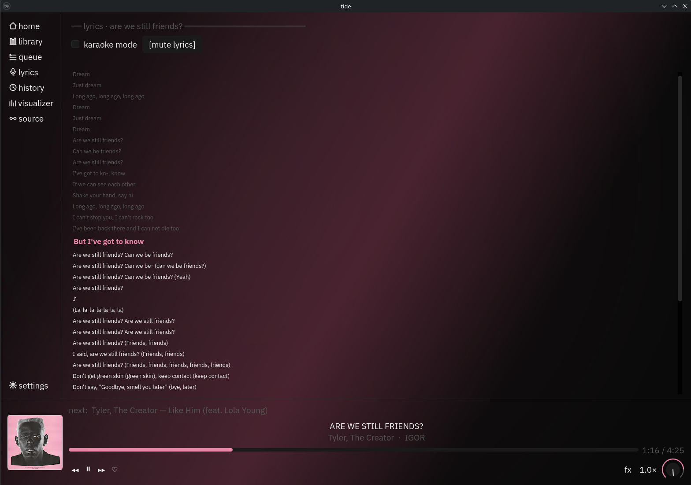
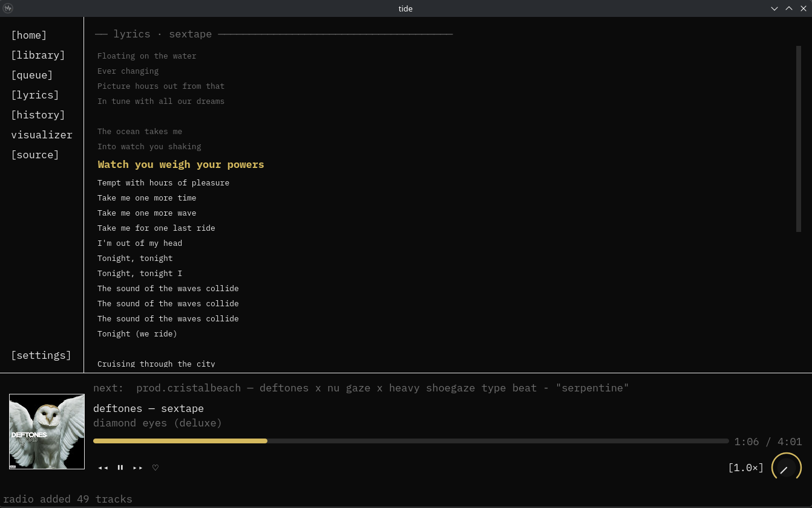

# tide

a music player for linux that pulls from youtube music, spotify, subsonic/navidrome, soundcloud, bandcamp, mixcloud and your local files, and lets you mix all of them in one queue. native Qt6 on top of mpv. no electron anywhere in the building.



```sh
yay -S tide
```

first launch walks you through signing into youtube music in your normal browser, then imports the cookies itself. that is the whole setup. everything else is optional and lives in the settings dialog, you never edit a config file.

## why i made it

i wanted a music app that looks like something. most players are a grey rectangle with a sidebar and i was tired of it, so tide ships sixteen themes and they are not palette swaps. each theme picks its own fonts, text casing (synthwave types in l33t, terminal-green and storm shout in caps, brutalist-mono stays lowercase), corner radius, widget variants, list markers and default visualizer. since v1.3 tide draws its own titlebar as well, so the theme goes to the very top pixel instead of stopping under your window manager's grey bar.

the new ones in v1.3: abyss (deep ocean), blackwater (true black, made for OLED), golden hour (warm light), storm (slate + one lightning-yellow accent), undertow (indigo + one blood-red accent). the older set covers gruvbox, nord, catppuccin, rosé pine, solarized-light, paper, ambient, synthwave, terminal-green and adaptive, which recolors itself from the current album cover.

if none of those fit, drop a `theme.toml` + `theme.qss` into `~/.config/tide/themes/` and it shows up in the picker. the font picker also lists every family on your system, drawn in its own face, with live preview.

## sources

| source | search | library | needs |
|---|---|---|---|
| youtube music | yes | playlists, albums, artists, home shelves | cookie import |
| spotify | yes | playlists, liked songs | login. playback is dead, see below |
| subsonic / navidrome | yes | playlists, albums, artists, shelves | your server url + login |
| local files | yes | albums, artists | a music directory |
| soundcloud | yes | no | nothing |
| bandcamp | yes | no | nothing |
| mixcloud | yes | no | nothing |

the queue does not care where a track came from. a youtube search result, a bandcamp deep cut and a local flac sit in the same queue and each one plays through the right backend. there is also a federated search mode that queries every enabled source at once and tags each result with where it came from.

about spotify: the integration exists and works for search and your library, but spotify's february 2026 platform-security change broke audio decryption for librespot on every account we tested, so playback is silence. tide tells you this when you enable it. if librespot ever gets around it, playback here starts working again with no update needed.

## what it does day to day

plays music, obviously. queue with radio autoplay when it runs low. synced lyrics (youtube's own timings first, LRClib fallback) with a karaoke mode. a history view, sleep timer, like button, resume-on-launch, and stream prefetch so track changes are close to instant.

there is a proper mini player now (v1.3): click the album art and you get a small frameless card where the window border is the progress bar, the backdrop breathes with the bass, a synced lyric ticks under the artist, and the controls fade out when you leave it alone. click the art again to come back. it can pin itself above other windows, KWin willing.

the fx rack (`Ctrl+9`) has a 10-band EQ, reverb presets including one called slowed, bass and treble shelves, loudness normalization, stereo width and a compressor. playback speed goes 0.5× to 2× and shifts pitch by default because that is the point, there is a preserve-pitch toggle for audiobook people. ten visualizer renderers run off a pipewire capture, `Ctrl+7`, F11 for fullscreen.

adaptive accent and the living backdrop are opt-in: the theme accent drifts toward the current cover's dominant color and the whole window (titlebar included) glows with it, optionally swelling on bass.

system stuff: MPRIS2 so media keys and the KDE/GNOME panel work, tray with hide-on-close, optional discord rich presence with a live-lyric mode, optional listenbrainz scrobbling, and a daily update check against github releases.



## install

arch: `yay -S tide` and you are done, every dependency resolves from the repos except python-spotipy which comes from the AUR alongside it.

building by hand does the same thing the AUR does:

```sh
git clone https://github.com/captiencelovesarch/tide.git
cd tide
makepkg -si
```

other distros: untested and unsupported, but it is plain python + PySide6 + mpv, so `PYTHONPATH=src python -m tide` after installing the deps from the tech list below will probably run. the visualizer wants `parec` from pipewire-pulse. no promises.

signing in: google blocks OAuth for the youtube music endpoints, so cookies are the only path that works. tide reads them out of a chromium-family browser (chromium, chrome, brave, vivaldi, edge) with your wallet key, or you can use the embedded sign-in window instead. when the session dies, and it will die whenever google feels like it, tide notices, says so, and offers a one-click refresh that re-imports from your still-signed-in browser. sessions imported before v1.2.7 just re-import once.

## keys

| key | action |
|---|---|
| `Ctrl+1` … `Ctrl+9` | views: home, library, queue, lyrics, history, explore, visualizer, sources, fx |
| `Space` | play / pause |
| `Ctrl+→` / `Ctrl+←` | next / previous |
| `Ctrl+↑` / `Ctrl+↓` | volume |
| `[` `]` `\` | speed down / up / reset |
| `Ctrl+H` | like |
| `Ctrl+I` | sleep timer |
| `Ctrl+M` | mini player |
| `Ctrl+F` | search |
| `F11` | fullscreen visualizer |

right-click a track row for play now / play next / add to queue / start radio.

## where things live

| path | what |
|---|---|
| `~/.config/tide/settings.toml` | all settings. written by the app, not by you |
| `~/.config/tide/browser.json` | imported cookies, 0600 |
| `~/.config/tide/themes/`, `layouts/` | your own themes and layouts |
| `~/.cache/tide/` | stream urls, art, lyrics, history, session |

config and cache roots are 0700, credential files 0600, writes are atomic. subsonic stream urls are never cached because they carry auth. the longer security story is in [SECURITY.md](SECURITY.md).

## tech

```
python 3.12+       PySide6 (Qt6)      mpv + python-mpv
ytmusicapi         yt-dlp             spotipy (+ librespot)
mutagen            cryptography       numpy
parec              ttf-ibm-plex       JetBrains Mono + Inter bundled
optional: pypresence, secretstorage, kwallet, watchdog
```

full history in the [changelog](CHANGELOG.md). it is long because i keep adding things.

## license

[GPL-3.0-or-later](LICENSE). not affiliated with youtube, google, spotify or anyone else. cookies and tokens stay on your machine.

---

made with care, claude, and a lot of "lol let's just add that too"
