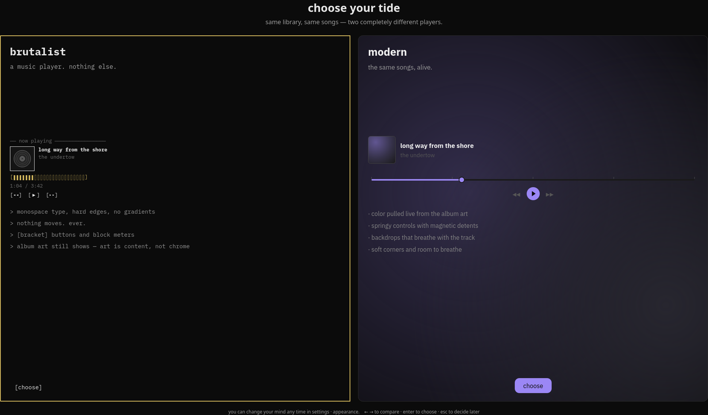
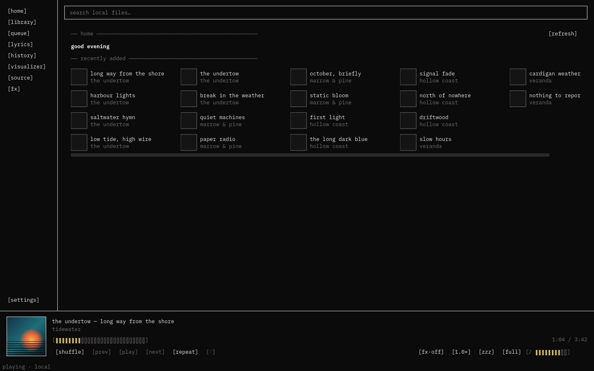
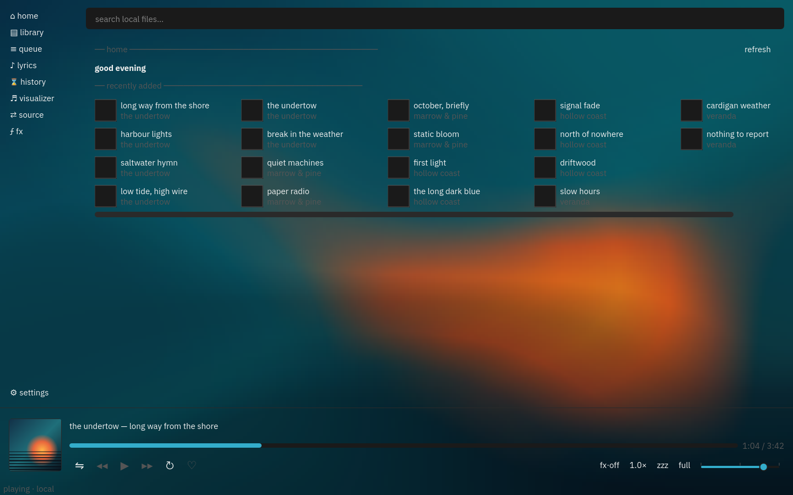
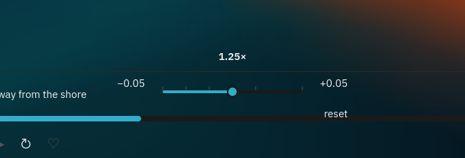
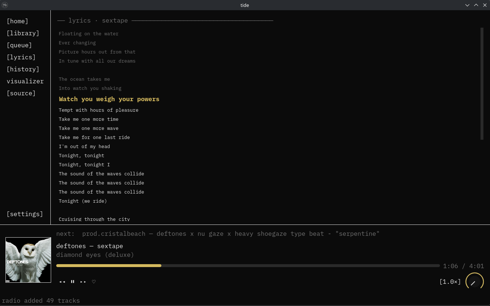

# tide

a music player for linux that pulls from youtube music, spotify, subsonic/navidrome, soundcloud, bandcamp, mixcloud and your local files, and lets you mix all of them in one queue. native Qt6 on top of mpv. no electron anywhere in the building.

since 2.0 it is also two players. **brutalist**: a music player. nothing else. **modern**: the same songs, alive. same library, same queue underneath — two completely different things to look at.



```sh
yay -S tide
```

first launch asks the one question above, then walks you through signing into youtube music in your normal browser and imports the cookies itself. that is the whole setup. everything else is optional and lives in the settings dialog, you never edit a config file.

## two players

**brutalist** is what tide has been since 1.0, distilled. monospace type, hard edges, no gradients, [bracket] buttons and block meters, nothing animates. album art still shows, because art is content, not chrome.



**modern** is the other answer: springy sliders that snap to magnetic detents and settle with a little overshoot, soft corners, icons, and a backdrop that takes its color from the album cover and moves with the bass.



they are not two themes. each personality owns its whole look — theme, layout, motion, corners, nav icons, glyphs, backdrops, sounds — and each remembers its own customizations. flip to modern, tweak it for a month, flip back: brutalist is exactly as you left it, your gruvbox and your slot layout included. the split holds at the engine level too: turn motion on in brutalist and you get clean mechanical animation, never bounce. the springs belong to modern.

the chooser appears once, on a fresh install or on the first launch after updating into 2.0, and dismissing it changes nothing — a 1.x install keeps exactly the look it had. after that it lives in settings → appearance: a quick flip picker, or the full-screen side-by-side again if you want to compare.

## why i made it

i wanted a music app that looks like something. most players are a grey rectangle with a sidebar and i was tired of it, so tide ships sixteen themes and they are not palette swaps. each theme picks its own fonts, text casing (synthwave types in l33t, terminal-green and storm shout in caps, brutalist-mono stays lowercase), corner radius, widget variants, list markers and default visualizer. five are brutalist, eleven are modern, and the picker shows the ones that fit the personality you're wearing, with a "show all" escape hatch for crossing over. since v1.3 tide draws its own titlebar as well, so the theme goes to the very top pixel instead of stopping under your window manager's grey bar.

the set: brutalist-mono, gruvbox, terminal-green, storm (slate + one lightning-yellow accent) and solarized-light on the brutalist side; adaptive (recolors itself from the current album cover), abyss, blackwater (true black, made for OLED), golden hour, undertow (indigo + one blood-red accent), nord, catppuccin, rosé pine, paper, ambient and synthwave on the modern side.

if none of those fit, drop a `theme.toml` + `theme.qss` into `~/.config/tide/themes/` and it shows up in the picker. the font picker also lists every family on your system, drawn in its own face, with live preview. and since 2.0 you don't need to write the files at all — see the next section.

## the power tools

settings → appearance grew a row of deep-cut editors in 2.0:

- **theme editor** — the active theme's colors, typography and radius, edited live on the whole running app. save the result and it becomes a real theme in `~/.config/tide/themes/`, in the picker next to the bundled ones.
- **strip builder** — build your own player bar: every slot on the strip picks its variant from a live miniature preview.
- **keymap editor** — every shortcut in the app, rebindable. the keymap is global on purpose; muscle memory doesn't flip with the personality.
- **glyph editor** — swap any transport glyph (▶ ▮▮ ♥ …) for one to three characters of your own, per personality.

nothing here touches a config file; everything previews live and reverts on cancel. the test suite (1324 tests) fails if a setting exists without a place in the GUI, which is how it stays that way.

## sources

| source | search | library | needs |
|---|---|---|---|
| youtube music | yes | playlists (editable), songs, albums, artists, subscriptions, home, charts, moods, account history | cookie import |
| spotify | yes | playlists, liked songs | login. playback is dead, see below |
| subsonic / navidrome | yes | playlists, albums, artists, shelves | your server url + login |
| local files | yes | albums, artists | a music directory |
| soundcloud | yes | no | nothing |
| bandcamp | yes | no | nothing |
| mixcloud | yes | no | nothing |

the queue does not care where a track came from. a youtube search result, a bandcamp deep cut and a local flac sit in the same queue and each one plays through the right backend. there is also a federated search mode that queries every enabled source at once and tags each result with where it came from.

about spotify: the integration exists and works for search and your library, but spotify's february 2026 platform-security change broke audio decryption for librespot on every account we tested, so playback is silence. tide tells you this when you enable it. if librespot ever gets around it, playback here starts working again with no update needed.

## what it does day to day

plays music, obviously. queue with radio autoplay when it runs low. synced lyrics (youtube's own timings first, LRClib fallback) with a karaoke mode. a history view, sleep timer, like button, resume-on-launch, and stream prefetch so track changes are close to instant. tide is single-instance now: launch it again and the running window comes forward instead of a second one fighting it for the settings file.

v1.5 filled out the youtube music side. the home tab is an actual feed: greeting with your listening stats, quick-pick grids, mosaics that reshuffle daily, ranked charts, new releases, mood chips. if you preferred the plain rows, settings → appearance → "plain shelves" brings them back. every track has a song page (click the now-playing title) with view and like counts, credits, related songs including other recordings of the same track, and the youtube comments. comments are read-only and threaded, and timestamps inside them are clickable, so "the drop at 3:31" seeks to 3:31. the library has real tabs (songs / albums / artists / following), playlists can be edited from any right-click, the queue can be saved as a playlist, and the history view shows both what tide played and what your account played everywhere else.

tide can also report plays to your youtube music account, using the same play event the web player sends. that keeps your recommendations current when you listen here instead of in a browser. it's off unless you turn it on: the setup wizard asks directly, with nothing pre-checked, and explains that off means google gets nothing from tide. existing installs stay off until you flip it in settings → integrations.

there is a proper mini player (v1.3): click the album art and you get a small frameless card where the window border is the progress bar, the backdrop breathes with the bass, a synced lyric ticks under the artist, and the controls fade out when you leave it alone. click the art again to come back. it can pin itself above other windows, KWin willing.

and the opposite of the mini (2.0): a fullscreen mode. `F11` anywhere, or the `[⤢]` button on the strip. big album art with the title under it, and level with it a pane for synced lyrics or the queue, your backdrop behind everything. the lyrics glide as lines advance, and the queue is the real one: double-click a row to jump. controls and cursor fade out when the mouse goes idle and come back when it moves, and the screen stays awake while music plays. made for putting a song on the speakers and going to do something else. esc gets you back, `l` and `q` switch the pane, karaoke mode sits in the right-click menu (`k`) next to the backdrop picker.

the fx rack (`Ctrl+8`) has a 10-band EQ, a real reverb (room, hall, plate, cathedral, and one called slowed), bass and treble shelves, loudness normalization, stereo width, a compressor, and an effects drawer: chorus, flanger, phaser, tremolo, exciter, headphone crossfeed and a lofi mode. playback speed goes 0.5× to 2× and shifts pitch by default because that is the point; there is a preserve-pitch toggle for audiobook people. in modern the speed popover is a spring slider with detents at the usual stops, brutalist keeps its [bracket] stepper, and a source that can't do variable speed says so — spotify greys the control instead of quietly ignoring you. ten visualizer renderers run off a pipewire capture, `Ctrl+6`, F11 for fullscreen.



adaptive accent and the living backdrop are modern's defaults and opt-in anywhere: the theme accent drifts toward the current cover's dominant color and the whole window (titlebar included) glows with it, swelling on bass. the bass pulse learns each track: the first listen is live detection, and tide records what the detector heard. from the next play on, the recording is replayed against the player clock, so the pulse lands on the beat instead of a frame after it. the live detector stays underneath — it covers whatever the recording doesn't, and takes back over if the audio stops matching what was recorded.

system stuff: MPRIS2 so media keys and the KDE/GNOME panel work, tray with hide-on-close, optional discord rich presence with a live-lyric mode, optional listenbrainz scrobbling, and a daily update check against github releases.



## install

arch: `yay -S tide` and you are done, every dependency resolves from the repos except python-spotipy which comes from the AUR alongside it.

building by hand does the same thing the AUR does:

```sh
git clone https://github.com/captiencelovesarch/tide.git
cd tide
makepkg -si
```

other distros: untested and unsupported, but it is plain python + PySide6 + mpv, so `PYTHONPATH=src python -m tide` after installing the deps from the tech list below will probably run. the visualizer wants `parec` from pipewire-pulse. no promises.

signing in: google blocks OAuth for the youtube music endpoints, so cookies are the only path that works. tide reads them out of a chromium-family browser (chromium, chrome, brave, vivaldi, edge) with your wallet key, or you can use the embedded sign-in window instead. when the session dies, and it will die whenever google feels like it, tide notices, says so, and offers a one-click refresh that re-imports from your still-signed-in browser. sessions imported before v1.2.7 just re-import once.

## keys

the defaults — every one of them is rebindable in the keymap editor.

| key | action |
|---|---|
| `Ctrl+1` … `Ctrl+9` | views: home, library, queue, lyrics, history, visualizer, sources, fx, settings |
| `Space` | play / pause |
| `Ctrl+→` / `Ctrl+←` | next / previous |
| `Ctrl+↑` / `Ctrl+↓` | volume |
| `Ctrl+S` / `Ctrl+R` | shuffle / repeat |
| `[` `]` `\` | speed down / up / reset |
| `Ctrl+H` | like |
| `Ctrl+I` | sleep timer |
| `Ctrl+M` | mini player |
| `Ctrl+L` / `Ctrl+F` | search |
| `Ctrl+Shift+R` | refresh yt session |
| `F11` | fullscreen mode (on the visualizer view: fullscreen visualizer) |

right-click a track row for play now / play next / add to queue / start radio.

## where things live

| path | what |
|---|---|
| `~/.config/tide/settings.toml` | all settings. written by the app, not by you |
| `~/.config/tide/browser.json` | imported cookies, 0600 |
| `~/.config/tide/themes/`, `layouts/` | your own themes and layouts — the theme editor saves here too |
| `~/.cache/tide/` | stream urls, art, lyrics, history, session |

config and cache roots are 0700, credential files 0600, writes are atomic. subsonic stream urls are never cached because they carry auth. the longer security story is in [SECURITY.md](SECURITY.md).

## tech

```
python 3.12+       PySide6 (Qt6)      mpv + python-mpv
ytmusicapi         yt-dlp             spotipy (+ librespot)
mutagen            cryptography       numpy
parec              IBM Plex + JetBrains Mono + Inter bundled
optional: pypresence, secretstorage, kwallet, watchdog
```

full history in the [changelog](CHANGELOG.md). it is long because i keep adding things.

## license

[GPL-3.0-or-later](LICENSE). not affiliated with youtube, google, spotify or anyone else. cookies and tokens stay on your machine.

---

made with care, claude, and a lot of "lol let's just add that too"
